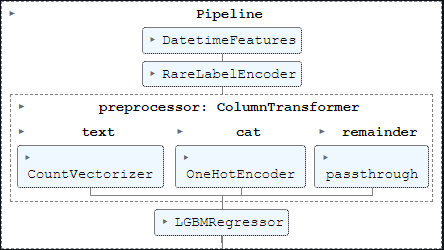

<!-- README.md is generated from README.Rmd. Please edit that file -->

```{r, include = FALSE}
knitr::opts_chunk$set(
  collapse = TRUE,
  comment = "#>"
)
```

# NYC Airbnb Prices

[](https://github.com/RodrigoFP51/nyc_ayrbnb_prices/blob/main/airbnb_analysis.md)

O aluguel de acomodações através do Airbnb se tornou uma alternativa popular e conveniente para muitos viajantes. Com a crescente demanda por acomodações, é importante para os proprietários e locatários terem uma compreensão clara do mercado imobiliário para precificar adequadamente suas propriedades.

A ciência de dados pode ser aplicada ao mercado imobiliário do Airbnb para prever preços de aluguel com base em uma série de fatores, como localização, tamanho do imóvel, número de comodidades e disponibilidade sazonal. Essa previsão pode ajudar proprietários e locatários a estabelecer preços competitivos e aumentar sua receita.

Neste projeto, exploraremos os dados do Airbnb e utilizaremos técnicas de análise exploratória de dados, visualização e modelagem preditiva para prever os preços de aluguel de propriedades do Airbnb. Através da análise desses dados, esperamos obter insights úteis sobre o mercado imobiliário do Airbnb e fornecer recomendações valiosas para proprietários e locatários de imóveis.

## Dados

- Dados: [Kaggle](https://www.kaggle.com/c/sliced-s01e05-WXx7h8/data)

Os dados foram baixados do Kaggle e vêm em formato .csv, em três arquivos:  
1.  `train.csv` é o arquivo na qual será feita a exploração dos dados e treinamento de modelos.  
2.  `test.csv` é utilizado para fazer a validação do modelo (não contém a variável a ser predita).  
3.  `sample_submission.csv` é um arquivo que nos mostrará a estrurura de como deve ser enviada o arquivo CSV para submeter à competição.  

| Nome da Coluna                              | Descrição                                                                             
|---------------------------------------------|----------------------------------------------
| id                                          | Identificador único
| name                                        | Nome da listagem
| host_id                                     | Identificador único para o anfitrião da listagem
| host_name                                   | Nome do anfitrião
| neighbourhood_group                         | Bairro onde a listagem está localizada (por exemplo, "Manhattan")
| neighbourhood                               | Bairro onde a listagem está localizada (por exemplo, "East Harlem")
| latitude                                    | Latitude da localização da listagem
| longitude                                   | Longitude da localização da listagem
| room_type                                   | Tipo de quarto ('Entire home/apt', 'Private room' ou 'Shared room')
| price                                       | Custo para uma reserva de uma noite da listagem
| minimum_nights                              | Número mínimo de noites necessárias para reservar a listagem
| number_of_reviews                           | Número de avaliações que a listagem possui
| last_review                                 | Data da última avaliação da listagem
| reviews_per_month                           | Número de avaliações que a listagem recebe por mês, em média
| calculated_host_listings_count              | Número de listagens que o anfitrião possui
| availability_365                            | Número de dias no ano em que a listagem está disponível


## Pipeline

É criado um objeto Pipeline do Scikit-learn para armazenar as transformações e criação de features para os dados do modelo.  
1. `DateTimeFeatures` seleciona a variável `last_review` e, a partir dela, cria indicadores como ano, mês, trimestre, dia da semana, e um indicador se a data fornecida é fim de semana ou não.  
2. `RareLabelEncoder` pega os níveis mais raros da variável `neighbourhood` e os junta dentro de uma categoria **Other**.  
3. `ColumnTransformer` agrega um 3 diferentes transformadores:  
  + `text` que cria um Bag-of-Words;  
  + `cat` que transforma as variáveis categóricas através de **One Hot Encoding**;  
  + `remainder` indica que as variáveis restantes não se deve aplicar nenhuma transformação;  
4. `LGBMRegressor` é a instância do Light Gradient Boosting Machine, que é o algoritmo ensemble que utilizamos nessa tarefa.



<!-- badges: start -->
<!-- badges: end -->


