NYC Airbnb Data Analysis
================
Rodrigo F. Pizzinato
05/05/2024

``` r
library(tidyverse)
library(here)
library(tidytext)
library(lubridate)
library(ppsr)
library(ggthemes)
library(DataExplorer)
library(paletteer)
library(patchwork)

theme_set(
  ggthemes::theme_gdocs(12) +
    theme(
      axis.text = element_text(face = "bold", color = "#e37070")
    )
)
```

## Leitura dos dados

``` r
airbnb <- read_csv(here("Data/train.csv")) %>% 
  mutate(across(c(host_id, id), as.character))
```

Primeiramente é feita a leitura dos dados do arquivo CSV e as colunas
`host_id` e `id` são transformadas em tipo character, pois são
identificadores únicos e não devem ser utilizadas como números.

## Dados faltantes

``` r
airbnb %>% 
  plot_missing()
```

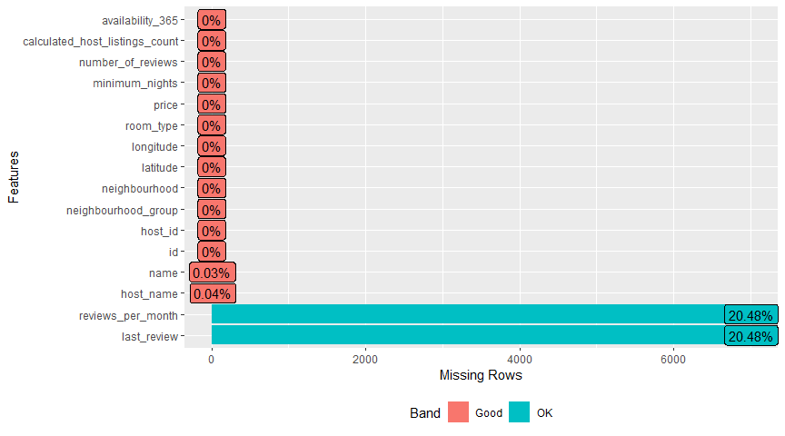<!-- -->

- `name` e `host_name` possuem uma proporção tão baixa de valores
  ausentes que não fará tanta diferença na qualidade dos dados se forem
  removidas essas observações.
- Já `reviews_per_month` e `last_review` são ótimos candidatos a terem
  seus valores imputados, pois são variáveis que provavelmente impactam
  nossa variável explicativa e excluir essas informações pode piorar o
  ajuste do modelo.

``` r
airbnb %>% 
  visdat::vis_miss()
```

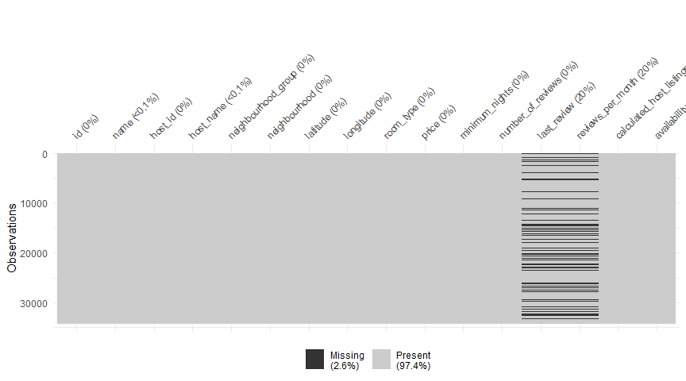<!-- -->

``` r
dlookr::diagnose_numeric(airbnb)
```

    ## # A tibble: 8 × 10
    ##   variables          min     Q1   mean median     Q3     max  zero minus outlier
    ##   <chr>            <dbl>  <dbl>  <dbl>  <dbl>  <dbl>   <dbl> <int> <int>   <int>
    ## 1 latitude         40.5   40.7   40.7   40.7   40.8     40.9     0     0     275
    ## 2 longitude       -74.2  -74.0  -74.0  -74.0  -73.9    -73.7     0 34226    1952
    ## 3 price             0     69    152.   105    175    10000       8     0    2073
    ## 4 minimum_nights    1      1      7.06   3      5     1250       0     0    4656
    ## 5 number_of_revi…   0      1     23.2    5     23      629    7008     0    4371
    ## 6 reviews_per_mo…   0.01   0.19   1.38   0.71   2.03    58.5     0     0    1268
    ## 7 calculated_hos…   1      1      7.18   1      2      327       0     0    4960
    ## 8 availability_3…   0      0    114.    46    230      365   12134     0       0

O resultado nos indica que a maior parte dos dados está dentro do comum,
tirando o fato de que existem 8 observações de preço que estão zerados,
que serão removidas.

``` r
airbnb <- airbnb %>% filter(price > 0)
```

## Distribuição das variáveis numéricas

``` r
g1 <- airbnb %>% 
  select(where(is.numeric), -price) %>% 
  pivot_longer(everything()) %>% 
  drop_na() %>% 
  ggplot(aes(value)) + 
  geom_histogram(fill = "#003366", color = "white", bins = 25, alpha = 0.75) +
  facet_wrap(vars(name), scales = "free") +
  labs(x='')

g2 <- airbnb %>% 
  ggplot(aes(price)) + 
  geom_histogram(fill = "#003366", color = "black", bins = 25, alpha = 0.75) +
  scale_x_continuous(labels = scales::dollar) +
  labs(x='')
  ggtitle("Price")
```

    ## $title
    ## [1] "Price"
    ## 
    ## attr(,"class")
    ## [1] "labels"

``` r
(g2 / g1) + patchwork::plot_annotation(title = "Distribution of Numerical Variables")
```

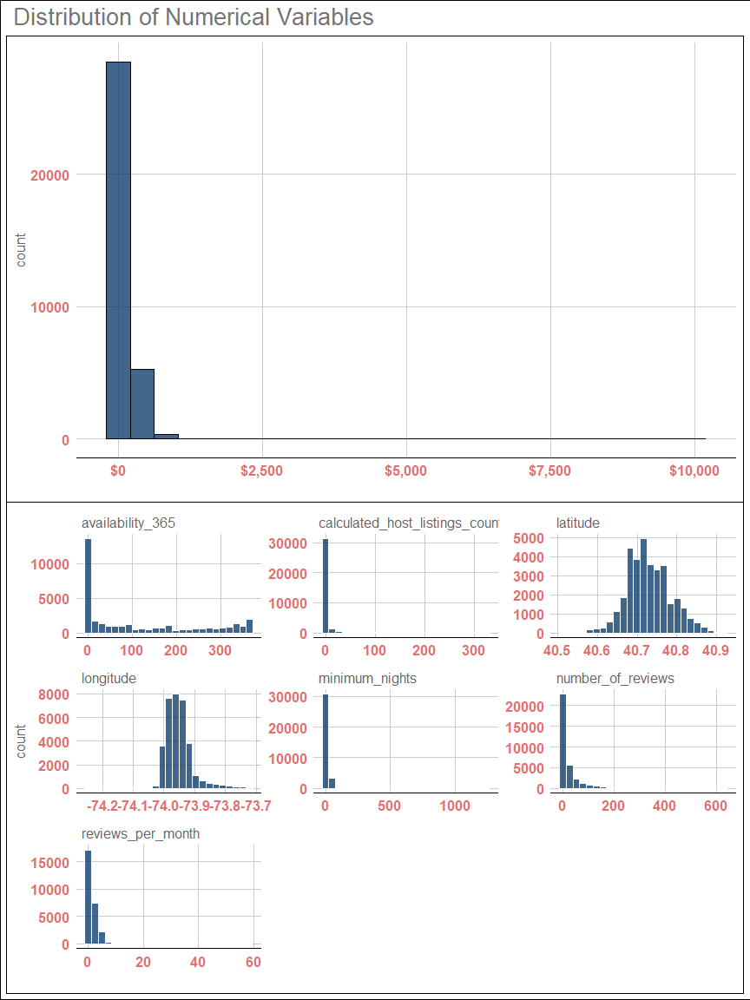<!-- -->

- Talvez o preço se beneficie com uma transformação logarítmica

``` r
g2 +
  scale_x_log10()
```

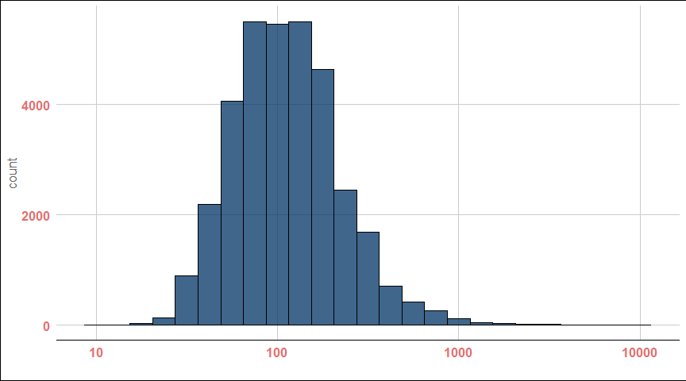<!-- -->

``` r
rm(g1,g2) # Remover os objetos de gráfico da memoria
```

- Se assemelhou muito a uma distribuição normal, portanto usarei
  logaritmo para a modelagem e alguns gráficos.

``` r
# DresdenColor::paired
plot_grouped_distributions <- function(data,
                                       group,
                                       palette = "DresdenColor::paired"){
  data %>% 
  ggplot(aes(price+1, {{group}}, # + 1 pra não ter valores zerados no preço
             fill = factor(after_stat(quantile)))) + 
  ggridges::stat_density_ridges(
    geom = "density_ridges_gradient",
    quantiles = 4,
    quantile_lines = TRUE,
    alpha = 0.8
  ) +
  geom_vline(xintercept = median(data$price), 
             lty = 2,
             linewidth = 1.5, 
             alpha = 0.75,
             color = "gray40") +
  scale_fill_paletteer_d(palette, name = "Quartil") +
  scale_x_log10(labels = scales::dollar, breaks = c(10,30,100,300,1000)) +
  labs(x='', y='')
}

airbnb %>% 
  mutate(neighbourhood_group = fct_reorder(neighbourhood_group, price)) %>% 
  filter(between(price, 10, 1000)) %>% 
  plot_grouped_distributions(neighbourhood_group)
```

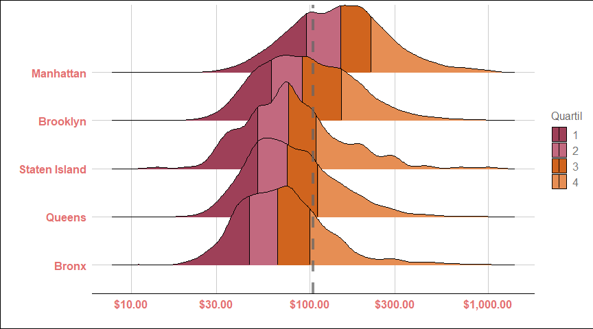<!-- --> -
Manhattan demonstra ter preços bem maiores, com seu primeiro quartil
sendo maior que o último quartil de Bronx.  
- Staten Island e Queens tem distribuições bem parecidas.  
- A feature tem um bom potencial para ser incluído no modelo.

``` r
airbnb %>% 
  filter(between(price, 10, 1000)) %>% 
  plot_grouped_distributions(room_type)
```

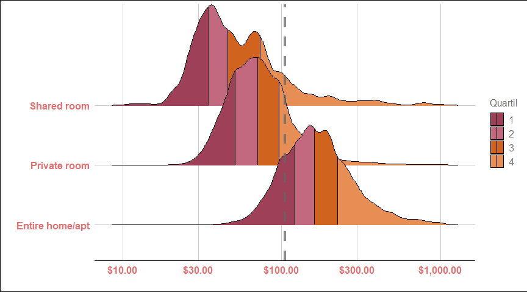<!-- --> -
Diferente de `neighborhood group`, `room type` distingue melhor os
preços.  
- Os quartos compartilhados, como esperado, são os mais baratos,
enquanto a casa/apartamento inteiro tem um preço muito mais elevado.  
- Até o momento me parece a feature com maior poder explicativo do
preço.

``` r
airbnb %>% 
  filter(between(price, 10, 1000)) %>% 
  mutate(neighbourhood = fct_lump(neighbourhood, n = 9),
         neighbourhood = fct_reorder(neighbourhood, price)) %>% 
  plot_grouped_distributions(neighbourhood)
```

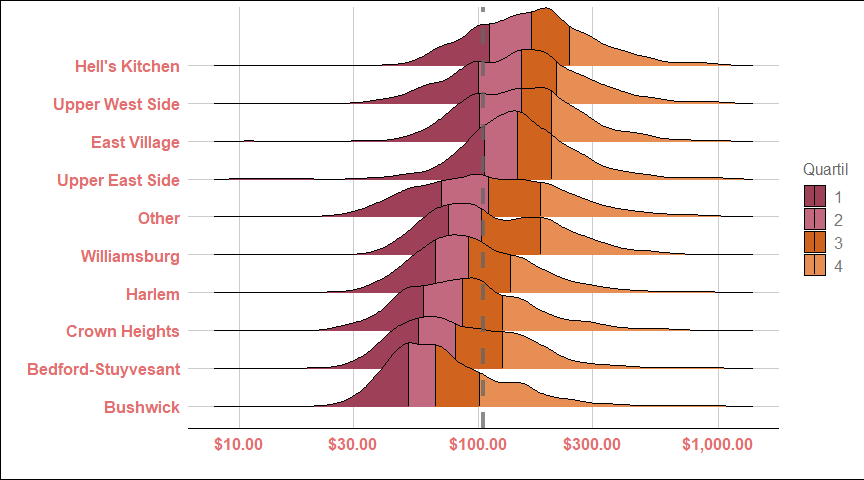<!-- --> -
Dado que existem 217 grupos diferentes na coluna `neighborhood` foi
necessário fazer uma redução e colocar os grupos mais infrequentes como
`outros`.  
- Hell’s Kitchen, Upper West Side e East Village são as vizinhanças mais
caras.  
- Pode ser uma variável preditora valiosa, mas seria mais interessante
utilizar apenas algumas categorias, para simplificar a modelagem.

## Predictive Power Score

``` r
pps <- airbnb %>% 
  select(-name, -host_name, -ends_with("id")) %>% 
  mutate(neighbourhood = fct_lump(neighbourhood, n = 9)) %>% 
  drop_na() %>% 
  ppsr::score_predictors(y = "price") %>% 
  filter(!is.na(baseline_score))

corr_features <- corrr::correlate(airbnb, 
                                  use = "pairwise.complete.obs") %>% 
  select(corr = price, term) %>% 
  drop_na()

g1 <- pps %>% 
  mutate(x = fct_reorder(x, pps)) %>% 
  ggplot(aes(x,pps, fill = pps)) +
  geom_col() +
  scale_fill_gradient(low = "#6497b1", high = "#011f4b") +
  coord_flip() +
  labs(x='',y='') +
  ggtitle("Predictive Power Score")

g2 <- corr_features %>% 
  ggplot(aes(term, corr, fill = corr)) +
  geom_col() +
  scale_fill_gradient(low = "#6497b1", high = "#011f4b") +
  coord_flip() +
  ggtitle("Correlacao: Pearson") +
  labs(x='',y='') 

(g1 / g2)
```

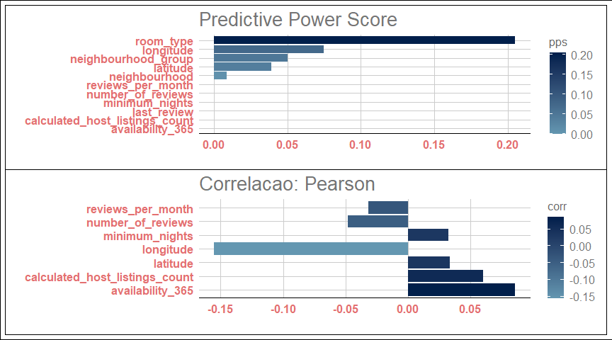<!-- --> O
Predictive Power Score é uma forma de estimar quais variáveis são
importantes preditoras de outra em um conjunto de dados.

## Reviews

``` r
airbnb_tokens <- airbnb %>% 
  unnest_tokens(word, name) %>% 
  anti_join(stop_words, by = "word") %>% 
  filter(str_detect(word, regex("^<U|[:digit:]"), negate = TRUE))

airbnb_tokens %>% 
  group_by(word) %>% 
  summarize(median_price = median(price),
            n = n()) %>%
  filter(n > 50) %>% 
  slice_max(median_price, n = 20) %>% 
  mutate(word = fct_reorder(word, median_price)) %>% 
  ggplot(aes(word, median_price, size = n)) +
  geom_point(pch = 18, size = 5, color = "darkblue") +
  #geom_text(aes(label = n), hjust = 1, color = "white", fontface = "bold") +
  scale_y_continuous(labels = scales::dollar) +
  coord_flip() +
  labs(x='', y='Preço mediano',
       title = "Preço associado a cada palavra da descrição") 
```

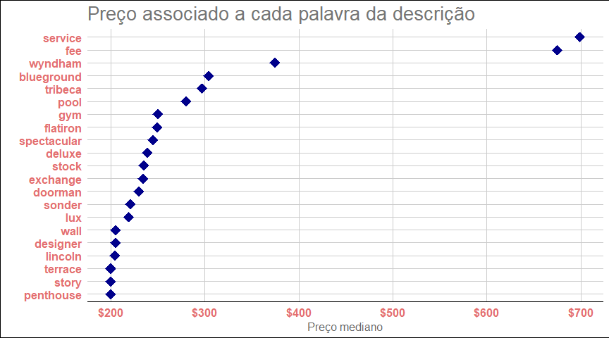<!-- -->

## Mapas e preço

``` r
airbnb %>% 
  ggplot(aes(latitude,longitude, z = log(price))) + 
  stat_summary_hex(bins = 50) +
  scale_fill_paletteer_c("scico::bamako", direction = -1, name = "Log of Price")  +
  guides(fill = guide_colorbar(title.position = "top")) +
  labs(x='', y='',
       title = "") +
  theme(legend.direction = "horizontal", 
        legend.position = c(0.85,0.1), 
        legend.background = element_blank()) +
  theme_minimal()
```

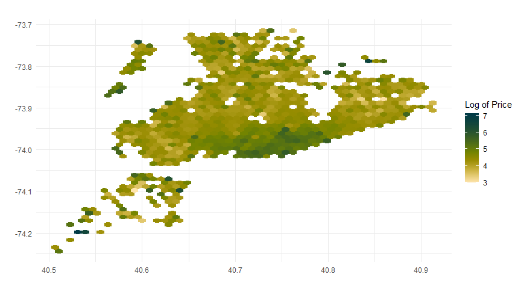<!-- -->

``` r
airbnb %>% 
  keep(is.numeric) %>% 
  cor(use = "pairwise.complete.obs") %>% 
  ggcorrplot::ggcorrplot(lab = TRUE)
```

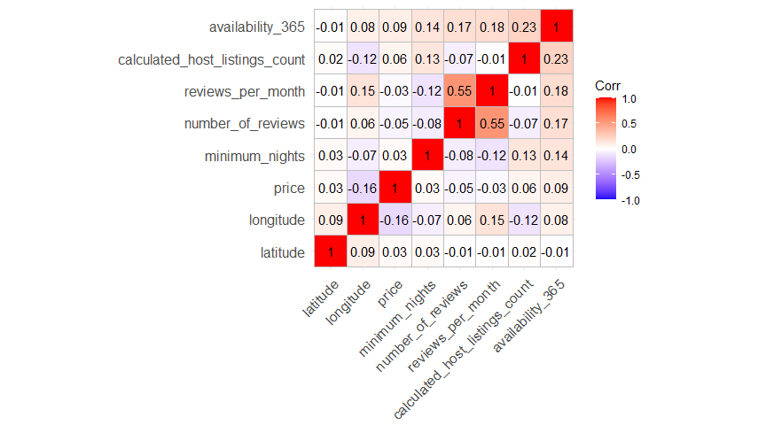<!-- -->

``` r
airbnb %>% 
  filter(price < 1000) %>% 
  drop_na() %>% 
  mutate(year = year(last_review),
         month = month(last_review, label = TRUE, abbr = TRUE)) %>% 
  select(price, year, month) %>%
  group_by(year,month) %>% 
  summarize(price = median(price),
            color = if_else(price < 100, "black", "white"),
            .groups = "drop") %>% 
  ggplot(aes(year, month, fill = price)) +
  geom_tile(linejoin = "round", color = "white") +
  geom_text(aes(label = scales::dollar(price), color = color),
            show.legend = FALSE,
            fontface = "bold") +
  scale_x_continuous(breaks = 2011:2019) +
  scale_color_manual(values = c("black","white")) +
  scale_fill_paletteer_c("scico::bamako",
                         name = "Price",
                         direction = -1) +
  theme_minimal() +
  labs(x='', y='',
       title = "Mediana do preço por ano e mês") + 
  theme(plot.title = element_text(hjust = 0.5, size = 18))
```

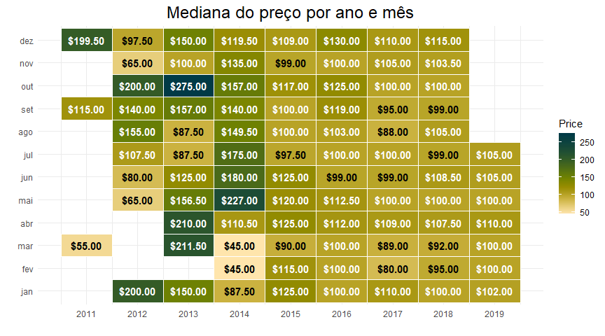<!-- -->

``` r
airbnb_imputed <- airbnb %>% 
  as.data.frame() %>% 
  simputation::impute_knn(reviews_per_month ~ minimum_nights + number_of_reviews, k = 4) %>% 
  as_tibble() %>% 
  fill(last_review, .direction = "down") %>% 
  drop_na()

write_csv(airbnb_imputed, file = here("Data/airbnb_imputed.csv"))
```
